# Авторизация

Для доступа к функционалу сайта пользователям необходимо пройти процесс авторизации. Доступ предоставляется только зарегистрированным пользователям, данные которых предварительно добавлены администратором системы.  

## Процесс авторизации
1. Пользователь вводит логин и пароль на странице входа.
2. При успешной валидации данных пользователь получает доступ к интерфейсу сайта.
3. Если введенные данные некорректны, система отобразит сообщение об ошибке.

## Валидация данных
При вводе логина и пароля система проверяет:
- Наличие логина в базе данных.
- Корректность пароля для указанного логина.
- Актуальность учетной записи (активный или деактивированный пользователь).

**Пример заполнения данных:**  

**Пример ошибки валидации:**  

## Успешная авторизация
После успешного входа пользователь перенаправляется на главную страницу приложения, где отображаются доступные функции.

**Пример успешного входа:**  

## Роли пользователей
В системе предусмотрено две роли пользователей: **Админ** и **HR**.  

### Админ
- Имеет доступ **только к странице Пользователей**.
- Не видит и не может использовать другие страницы системы.

### HR
- Имеет доступ **ко всем страницам системы**, **кроме страницы Пользователей**.
- Может управлять данными сотрудников, историей изменений и другими элементами функционала.

Распределение ролей позволяет обеспечить безопасность данных и разграничить доступ в зависимости от обязанностей пользователя.

---

# Страница организаций

Страница управления организациями позволяет добавлять, редактировать и удалять данные об организациях. Она является одной из ключевых страниц приложения, предоставляя доступ к информации, связанной с организациями.

## Функционал страницы организаций

### Отображение данных
На странице отображается список всех организаций.

**Пример отображения страницы в обычном состоянии:**  

### Создание организации
Для добавления новой организации:
1. Заполните форму с данными.
2. Нажмите кнопку "Добавить".
3. После успешного сохранения новая запись появится в списке.

**Пример создания записи:**  

### Изменение данных организации
Для редактирования данных:
1. Выберите организацию из списка.
2. Нажмите кнопку "Изменить".
3. Внесите изменения в форму.
4. Подтвердите изменения нажатием на кнопку "Сохранить изменения".

**Заполнение данных для изменения записи:**  
  

**Успешное изменение записи:**  

### Удаление организации
Для удаления записи:
1. Выберите организацию из списка.
2. Нажмите кнопку "Удалить".
3. На клиенте запись будет удалена из отображения, а в базе данных помечена датой в поле `deleted_at`.

**Удаление записи на клиенте:**  

**Отображение удалённой записи в базе данных:**  

Эта страница позволяет эффективно управлять данными об организациях, обеспечивая удобство и безопасность операций. 

---

# Страница отделов

Страница управления отделами позволяет добавлять, редактировать и удалять данные об отделах в организациях. Этот раздел помогает структурировать организационную иерархию.

## Функционал страницы отделов

### Отображение данных
На странице отображается список всех отделов.

**Пример отображения страницы в обычном состоянии:**  

### Создание отдела
Для добавления нового отдела:
1. Заполните форму с данными.
2. Нажмите кнопку "Добавить".
3. После успешного сохранения новая запись появится в списке.

**Пример создания записи:**  

### Изменение данных отдела
Для редактирования данных:
1. Выберите отдел из списка.
2. Нажмите кнопку "Изменить".
3. Внесите изменения в форму.
4. Подтвердите изменения нажатием на кнопку "Сохранить изменения".

**Заполнение данных для изменения записи:**  
  

**Успешное изменение записи:**  

### Удаление отдела
Для удаления записи:
1. Выберите отдел из списка.
2. Нажмите кнопку "Удалить".
3. На клиенте запись будет удалена из отображения, а в базе данных помечена датой в поле `deleted_at`.

**Удаление записи на клиенте:**  

**Отображение удалённой записи в базе данных:**  

Эта страница помогает эффективно управлять структурой организации, обеспечивая удобство и безопасность операций.

---

# Страница должностей

Страница управления должностями предоставляет возможность добавлять, редактировать и удалять должности в рамках организации. Этот раздел помогает структурировать рабочие роли в компании.

## Функционал страницы должностей

### Отображение данных
На странице отображается список всех должностей.

**Пример отображения страницы в обычном состоянии:**  

### Создание должности
Для добавления новой должности:
1. Заполните название должности.
2. Нажмите кнопку "Добавить".
3. После успешного сохранения новая запись появится в списке.

**Пример создания записи:**  

### Изменение данных должности
Для редактирования данных:
1. Выберите должность из списка.
2. Нажмите кнопку "Редактировать".
3. Внесите изменения в форму.
4. Подтвердите изменения нажатием на кнопку "Сохранить изменения".

**Заполнение данных для изменения записи:**  
  

**Успешное изменение записи:**  

### Удаление должности
Для удаления записи:
1. Выберите должность из списка.
2. Нажмите кнопку "Удалить".
3. На клиенте запись будет удалена из отображения, а в базе данных помечена датой в поле `deleted_at`.

**Удаление записи на клиенте:**  

**Отображение удалённой записи в базе данных:**  

Эта страница помогает эффективно управлять рабочими ролями, обеспечивая удобство и безопасность операций.

---

# Страница сотрудников

Страница управления сотрудниками предоставляет возможность добавлять, редактировать и удалять записи о сотрудниках, а также управлять связанными данными о паспорте и адресе.

## Функционал страницы сотрудников

### Отображение данных
На странице отображается список сотрудников, где данные из таблиц сотрудников, адресов и паспортов объединены. Ввод данных происходит для всех трёх таблиц, а отображение сведено к единой таблице.

**Пример отображения страницы:**  

### Создание записи
Для добавления нового сотрудника:
1. Нажмите кнопку "Добавить сотрудника".
2. Заполните формы для ввода данных в таблицы сотрудников, адресов и паспортов.
3. В поле для ввода должности выберите значение из доступных данных БД.
4. После успешного сохранения запись будет добавлена в список.

**Пример создания записи:**  

### Изменение записи
Для редактирования данных:
1. Выберите сотрудника из списка.
2. Нажмите кнопку "Редактировать".
3. Внесите изменения во всех связанных формах (данные сотрудника, паспорт и адрес).
4. Подтвердите изменения нажатием на кнопку "Сохранить изменения".

**Заполнение данных для изменения записи:**  
  

**Успешное изменение записи:**  

### Удаление записи
Для удаления записи:
1. Выберите сотрудника из списка.
2. Нажмите кнопку "Удалить".
3. На клиенте запись будет удалена из отображения, а в базе данных помечена датой в поле `deleted_at`.

**Удаление записи на клиенте:**  

**Удалённая запись в базе данных:**  

### Управление сканами
Для управления сканами документов сотрудника доступен следующий функционал:

#### Просмотр сканов
На странице каждого сотрудника можно просматривать прикреплённые сканы документов.  
**Пример просмотра сканов:**  
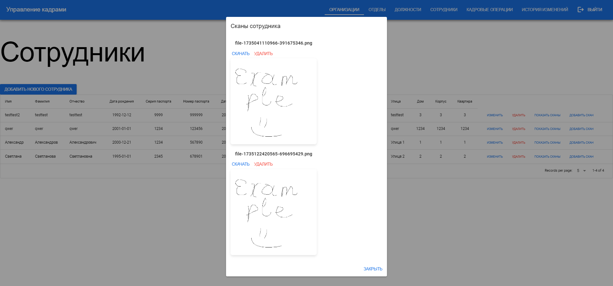

#### Добавление сканов
Чтобы добавить скан документа:
1. Перейдите к записи сотрудника.
2. Нажмите кнопку "Добавить скан".
3. Выберите файл на компьютере и нажмите кнопку "Сохранить".

**Пример добавления скана:**  
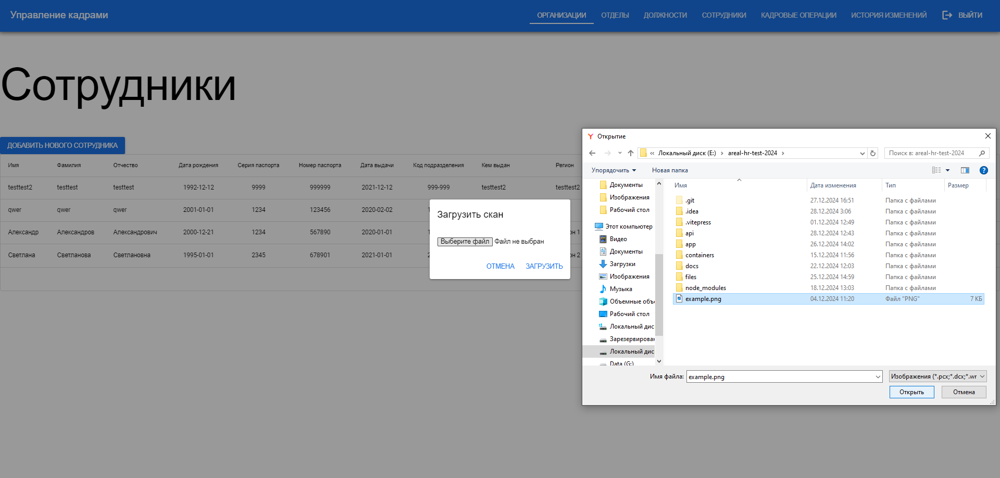

#### Удаление сканов
Для удаления скана документа:
1. Перейдите к записи сотрудника.
2. Нажмите кнопку "Показать сканы".
3. Выберите скан, который хотите удалить, и нажмите "Удалить".

**Пример удаления скана:**  
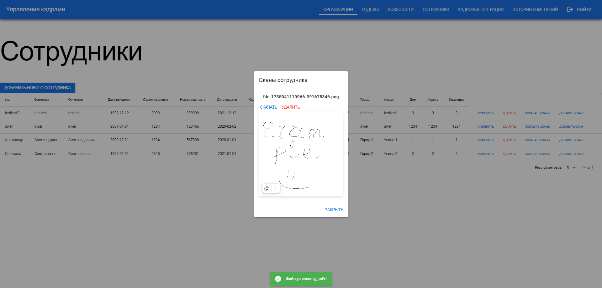

Эта страница обеспечивает удобное управление данными сотрудников и их связанной информацией, включая работу с документами, соблюдая консистентность данных между таблицами.

---

# Страница кадровых операций

Страница управления кадровыми операциями предоставляет функциональность для учета и управления различными операциями с сотрудниками, такими как переводы, увольнения, назначения и другие действия, связанные с их трудовой деятельностью.

## Функционал страницы кадровых операций

### Отображение данных
На странице отображаются все кадровые операции, связанные с сотрудниками, включая дату операции и тип операции.

**Пример отображения страницы:**  

### Создание записи
Для добавления новой кадровой операции:
1. Заполните данные, в спадающих списках выберите сотрудника, отдел и должность, для которых необходимо создать операцию.
2. Нажмите кнопку "Добавить".
3. После успешного выполнения операция будет добавлена в список.

**Выбор в спадающих списках, сотрудника, отдела и должности:**  

**Успешное добавление записи:**  

### Изменение записи
Для редактирования кадровой операции:
1. Выберите запись в списке.
2. Нажмите кнопку "Изменить".
3. Обновите необходимые данные.
4. Нажмите "Сохранить изменения".

**Заполнение данных для изменения записи:**  

**Успешное изменение записи:**  

### Удаление записи
Для удаления кадровой операции:
1. Выберите запись в списке.
2. Нажмите кнопку "Удалить".
3. Запись будет удалена из списка на клиенте, а в базе данных помечена датой в поле `deleted_at`.

**Удаление записи с сообщением об этом:**  

**Отображение удалённой записи в базе данных (с меткой удаления):**  

Страница кадровых операций обеспечивает удобное управление всеми кадровыми процессами в приложении.

---

# Страница историй изменений

Страница Историй изменений предоставляет пользователю возможность просматривать и управлять записи об изменениях, которые произошли в системе. Каждая запись фиксирует действия пользователей и содержит ключевую информацию о произошедших изменениях.

## Функционал страницы историй изменений

### Просмотр истории изменений
На странице отображается список изменений, которые включают следующие данные:
- **Место действия**: страница, где было выполнено действие.
- **Логин пользователя**: идентификатор пользователя, выполнившего изменение.
- **Изменённые поля**: перечень данных, которые были изменены.
- **Дата изменения**: время и дата, когда было выполнено действие.

Этот функционал позволяет администраторам отслеживать корректность действий пользователей и анализировать работу системы.

**Пример отображения истории изменений:**  
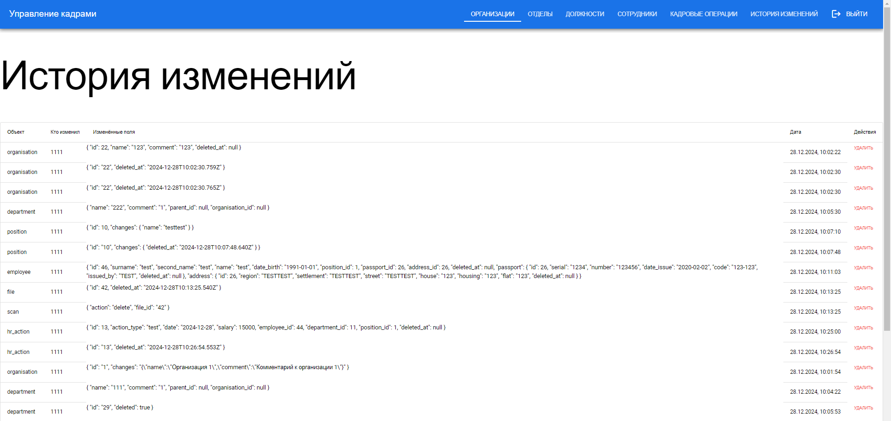

### Удаление записи истории
Для удаления записи из истории изменений:
1. Найдите запись в списке, которую нужно удалить.
2. Нажмите на кнопку "Удалить" рядом с записью.
3. Удаление выполнится, и запись исчезнет из списка на клиенте, а также будет мягко удалена из базы данных.

**Пример удаления записи истории изменений:**  
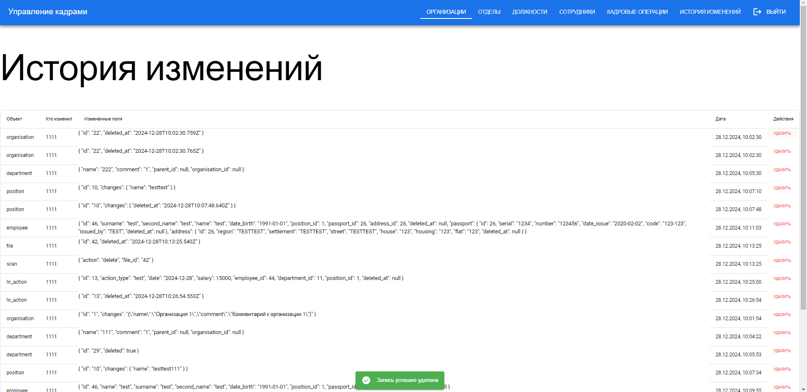

**Удалённая запись в базе данных:**  
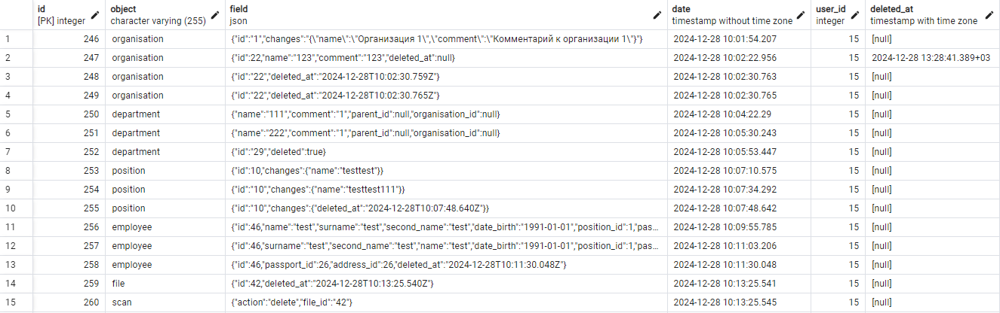

Страница истории изменений помогает обеспечить прозрачность всех действий пользователей, упрощать анализ и аудит работы системы, устранять проблемы или недоразумения, связанные с изменением данных.

Страница историй изменений делает управление системой более понятным и надёжным, предоставляя удобный интерфейс для анализа действий пользователей.

---

# Страница пользователей

Страница пользователей предоставляет интерфейс для управления учётными записями пользователей в системе. Здесь можно создавать, редактировать и удалять пользователей, а также просматривать список всех существующих записей. Страница доступно только пользователю-администратору.

## Функционал страницы пользователей

### Просмотр списка пользователей
На главном экране отображается таблица со всеми зарегистрированными пользователями, включая их основные данные:
- **Фамилия, имя и отчество**.
- **Логин**.
- **Роль пользователя**.

Эта информация позволяет администраторам удобно управлять доступом и следить за активностью учётных записей.

**Пример отображения списка пользователей:**  
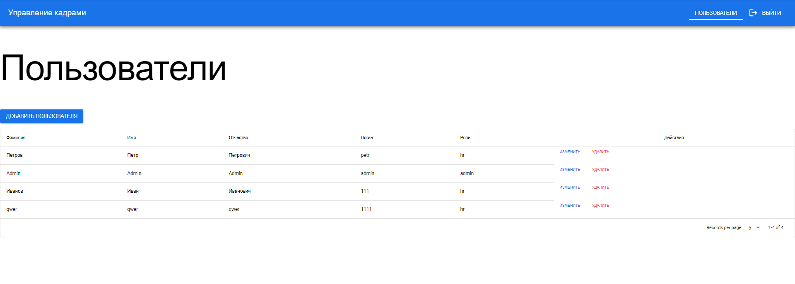

### Создание пользователя
Для добавления нового пользователя:
1. Нажмите кнопку "Добавить пользователя".
2. Заполните форму, указав фамилию, имя, отчество, логин и пароль.
3. Пароль будет автоматически шифроваться на сервере, перед отправкой на клиент.
4. Нажмите кнопку "Сохранить", чтобы завершить создание учётной записи.

После сохранения новая запись появится в списке.

**Пример создания нового пользователя:**  
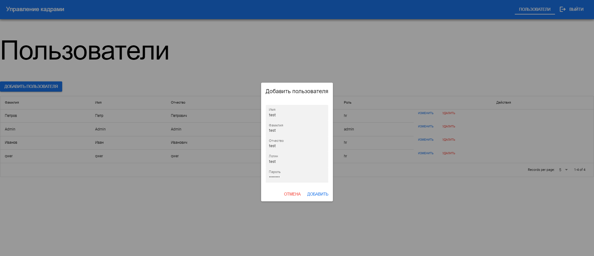

### Редактирование данных пользователя
Для изменения существующей записи:
1. Выберите пользователя из списка.
2. Нажмите кнопку "Изменить".
3. Обновите данные, которые необходимо изменить.
4. Сохраните изменения, нажав на кнопку "Сохранить".

Изменения сразу отобразятся в таблице.

**Пример заполнения формы для редактирования:**  
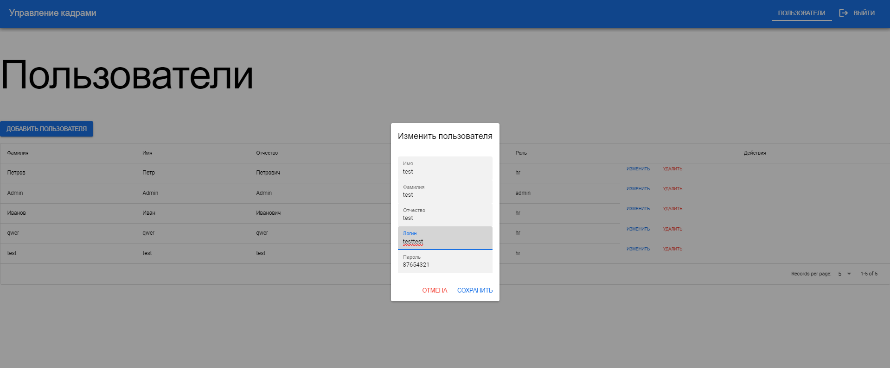  

**Пример успешного сохранения изменений:**  

### Удаление пользователя
Для удаления учётной записи:
1. Выберите пользователя из списка.
2. Нажмите кнопку "Удалить".
3. Удаление выполнится, и запись исчезнет из списка на клиенте, а также будет мягко удалена из базы данных.

Удалённый пользователь:
- Исчезает из списка на клиенте.
- Помечается как удалённый в базе данных через `deleted_at`.
- Не сможет авторизоваться в системе, даже если его данные остаются в БД.

**Пример удаления пользователя на клиенте:**  
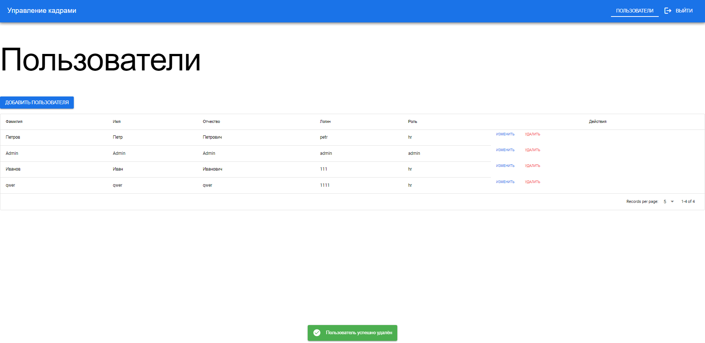

**Удалённая запись в базе данных:**  
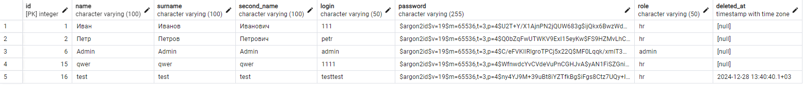

Страница пользователей обеспечивает надёжный интерфейс для администрирования учётных записей, удобное управление доступом пользователей и обеспечивает безопасность за счёт шифрования пароля.

---

## [Вернуться на главную страницу](index.md)